# MOENS TOKENS (MTK)
The maximum supply of the tokens is `10,000` 

The price of one token is `0.001 eth`

The tokens that one can claim if they hold one of [MoensNFT's](https://github.com/Stephen-Kimoi/NFT-Collection-v2) is `10 MTK`; 

## HOW TO USE 
Live site can be located over [here](https://moens-token.vercel.app/)

This is the landing page that you'll see
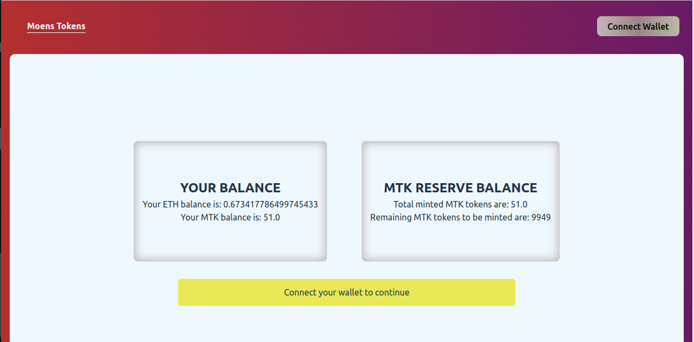 

## CONNECTING WALLET
Connect your wallet to get started 
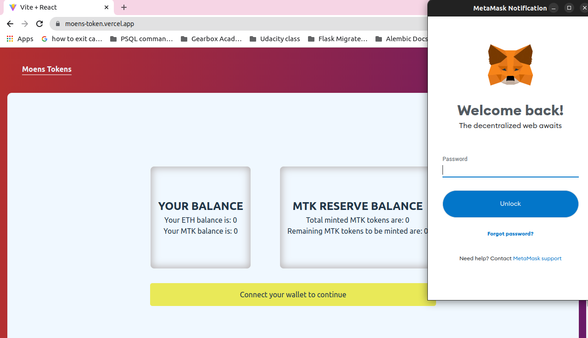

If you are not on the goerli network you'll see this warning. Click the `switch to goerli` button 
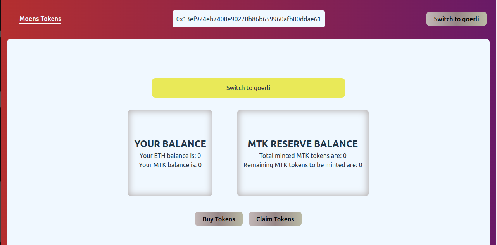

Follow the prompt 
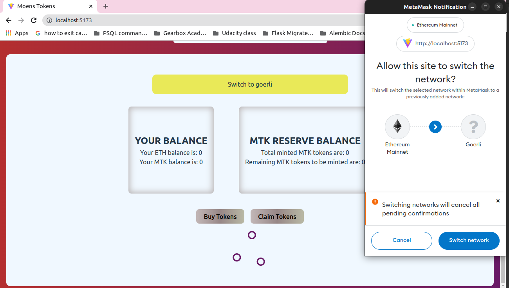

## BUY TOKENS
Once you're set you can now mint a token or claim tokens if you hold [Moens NFTs](https://moens-nft-collection.netlify.app/) 

To buy tokens, click on the `Buy tokens` tab and you'll see a new tab just below it
Input the amount of MTK you'd like to buy and follow the Metamask prompts 
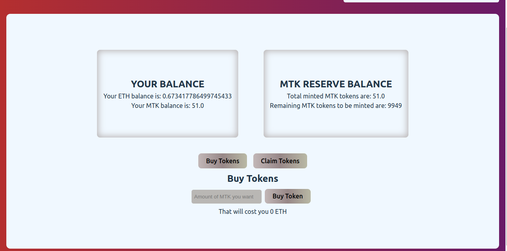

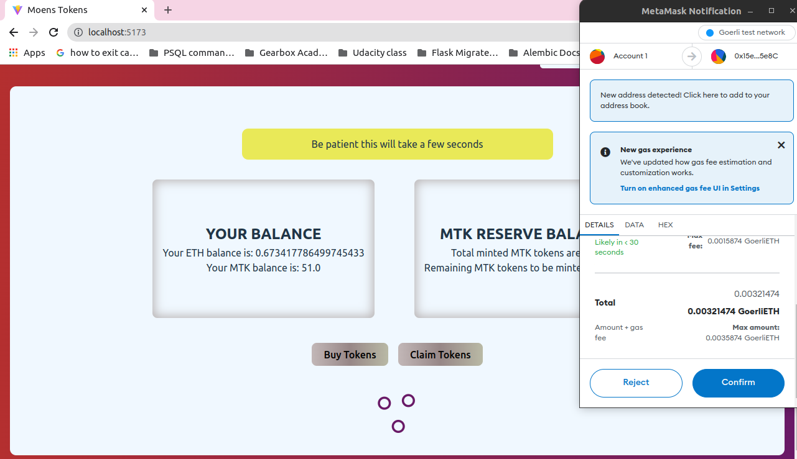

If its succesfull you'll see the success prompt
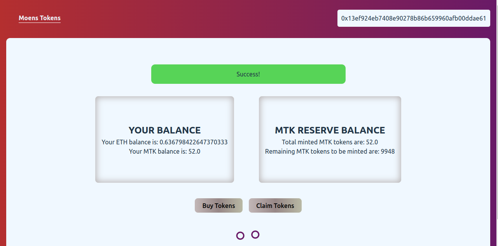

If an error occurs this is what you'll see: 
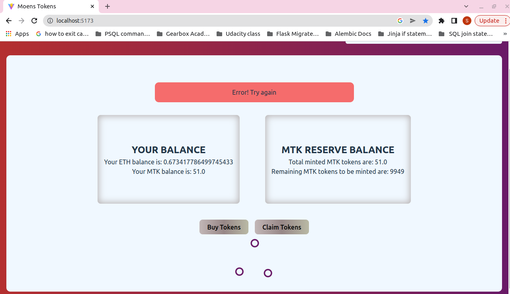

You can then check your MTK balance and you eth balance in this tab 
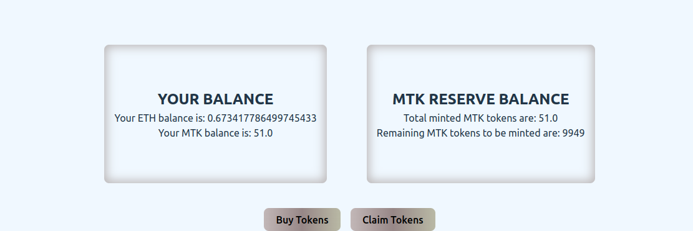

## CLAIM TOKENS
You can also reddem [Moens NFTs](https://moens-nft-collection.netlify.app/) 

The tokens that one claim for 1 Moens Token are `10 MTK` i.e `1 Moens Token = 10 MTK` 

Click on the `Claim Tokens` button
Enter the number of tokens you'd like to redeem & follow the metamask prompt. 

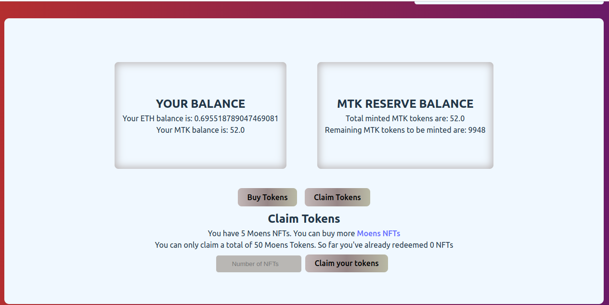

If you have redeemed all your NFTs you'll see this waring
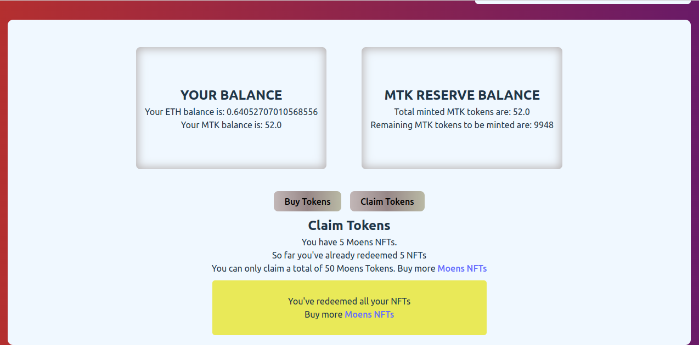

Proceed to buy more [Moens NFTs](https://moens-nft-collection.netlify.app/) 

# DISCLAIMER!!
This site can only work if you have [metamask](https://metamask.io/) installed. 

You also need some [GoerliETH](https://goerlifaucet.com/ ) to be able to mint an NFT. 

Here are a few sites where you can find some free ETH: 
1. https://goerlifaucet.com/ (most recommended)
2. https://faucet.paradigm.xyz/ (You need twitter account to claim GTH)
3. https://faucetlink.to/goerli
4. https://goerli-faucet.pk910.de/

